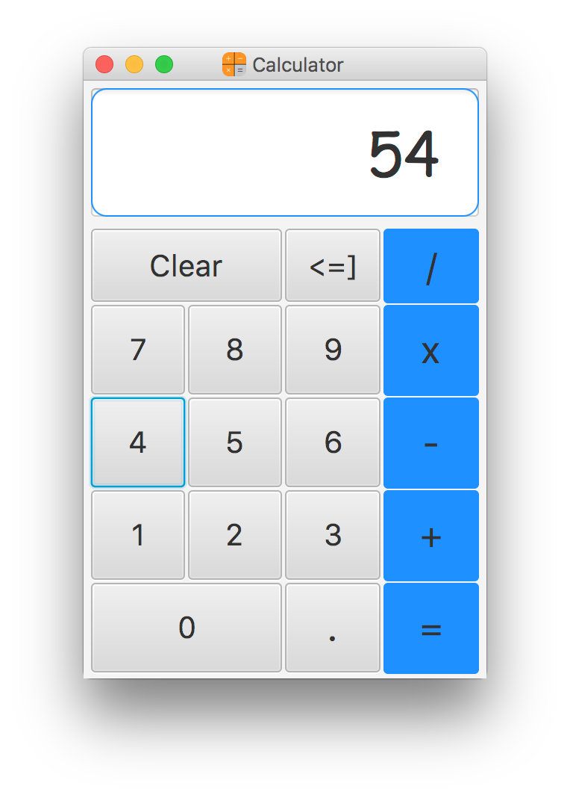

  

# BasicCalculator

> Basic calculator application built using **JavaFX**

# Features

* Perform mathematical operations (addition, subtraction etc.)

* Provide a user interface

# Technologies

* [Java](https://go.java/) - core language

* [JavaFX](http://docs.oracle.com/javafx/2/overview/jfxpub-overview.htm) - user interface library

